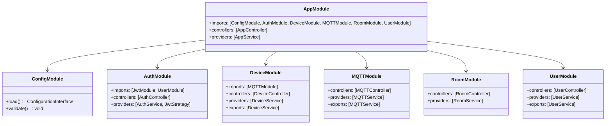
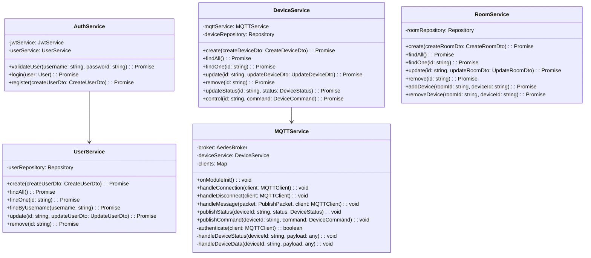
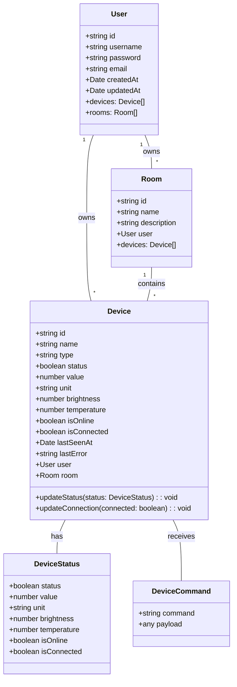
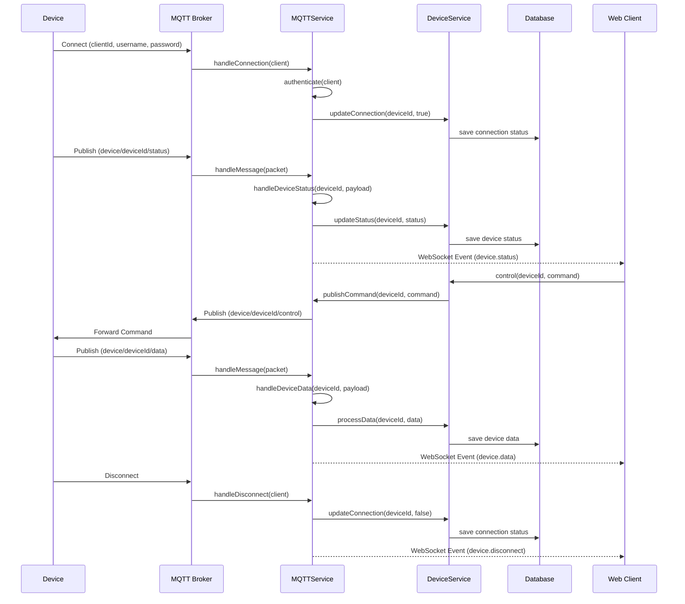
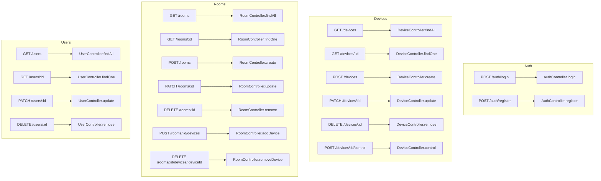
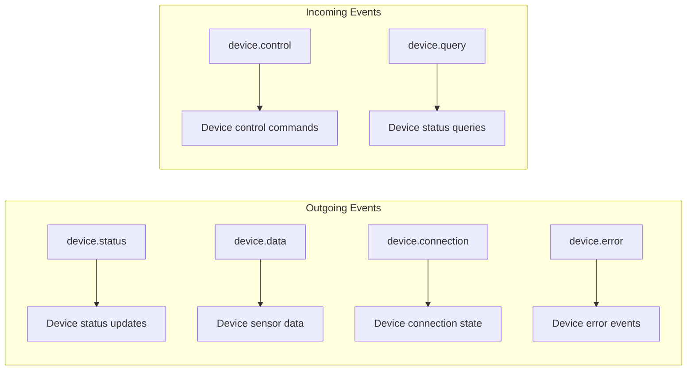
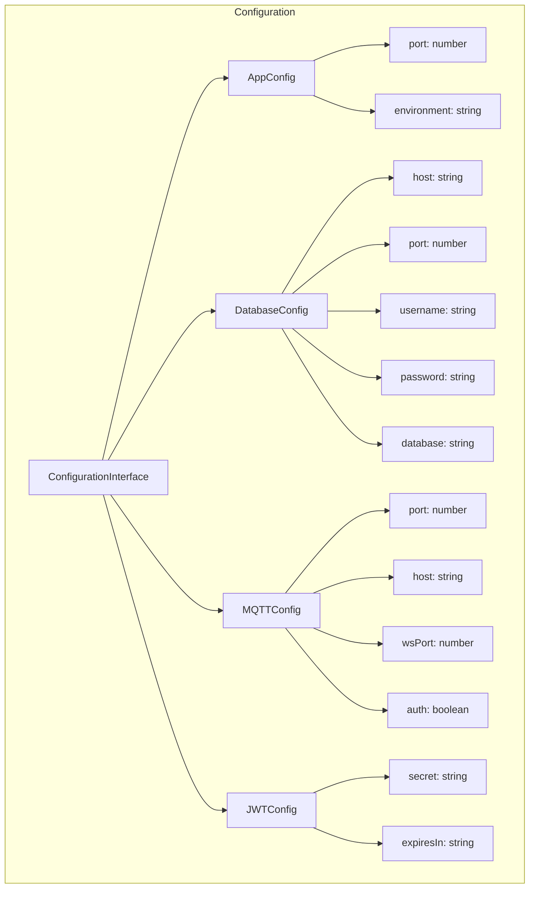

# Smart Home Backend Code Architecture

## Module Structure

## Service Layer

## Entity Relationships

## MQTT Communication Flow

## API Endpoints Structure

## WebSocket Events

## Configuration Structure

