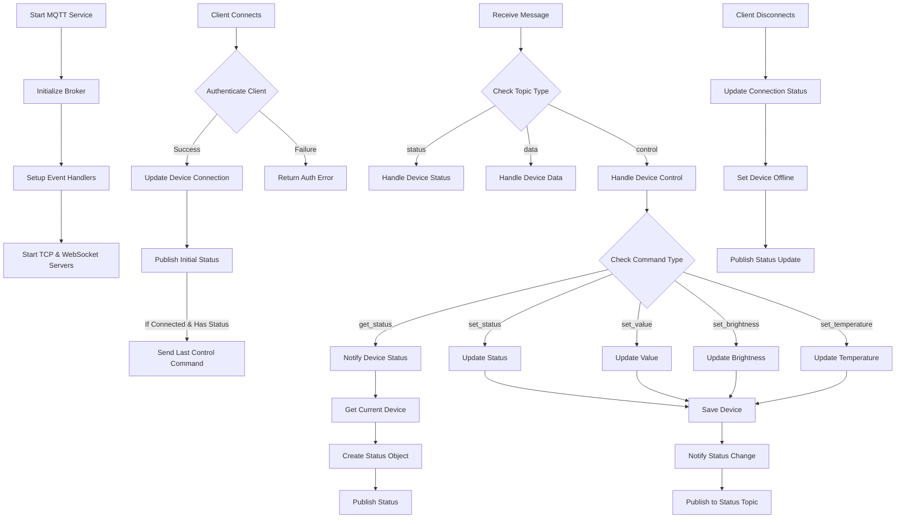

# MQTT Service Flow Diagram

This diagram shows the flow of MQTT service operations including device connections, message handling, and status updates.

## Flow Description

1. **Service Initialization**
   - Initialize MQTT broker
   - Setup event handlers
   - Start TCP and WebSocket servers

2. **Client Connection Flow**
   - Client connects
   - Authenticate client credentials
   - Update device connection status
   - Send initial status and last control command

3. **Message Handling**
   - Receive message on topic
   - Parse message type (status/data/control)
   - Route to appropriate handler

4. **Control Commands**
   - get_status: Fetch and notify current status
   - set_status: Update device power state
   - set_value: Update device value
   - set_brightness: Update device brightness
   - set_temperature: Update device temperature

5. **Status Updates**
   - Save device changes
   - Notify status changes
   - Publish to status topic

6. **Device Status Notification**
   - Get current device state
   - Create status object with all fields
   - Publish to device status topic

7. **Disconnection Flow**
   - Client disconnects
   - Update connection status
   - Set device offline
   - Publish status update

## MQTT Topics

All communication happens through MQTT topics in the format:
- `device/{deviceId}/status`: For device status updates
- `device/{deviceId}/data`: For device data updates
- `device/{deviceId}/control`: For control commands
