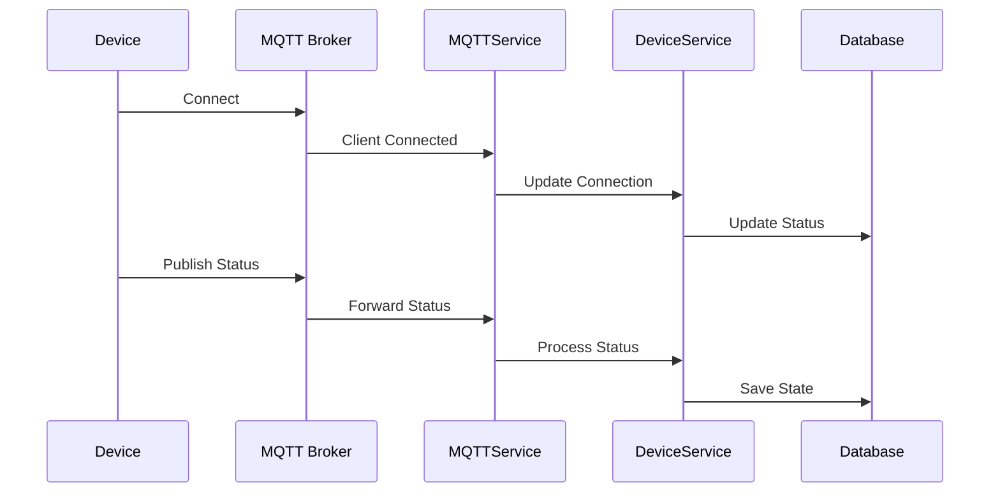
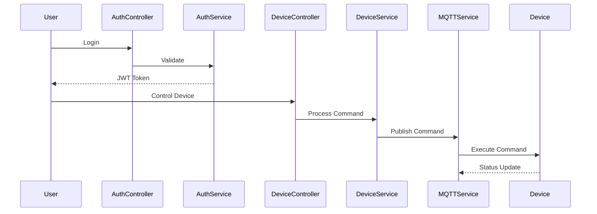
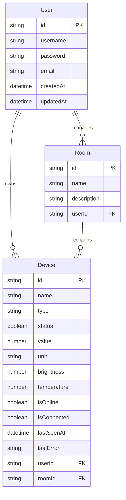

# Smart Home System Architecture

## System Overview Diagram

```mermaid
graph TD
    %% Client Layer
    Client[Web Browser] --> |HTTP/WebSocket| NestJS
    Device[IoT Device] --> |MQTT| MQTT[MQTT Broker]

    %% Application Layer
    subgraph NestJS[NestJS Backend]
        AppModule[App Module] --> |Uses| ConfigModule[Config Module]
        AppModule --> |Uses| AuthModule[Auth Module]
        AppModule --> |Uses| DeviceModule[Device Module]
        AppModule --> |Uses| MQTTModule[MQTT Module]
        AppModule --> |Uses| RoomModule[Room Module]
        AppModule --> |Uses| UserModule[User Module]

        %% Auth Module
        subgraph AuthModule
            AuthService[Auth Service]
            AuthController[Auth Controller]
            JwtStrategy[JWT Strategy]
        end

        %% Device Module
        subgraph DeviceModule
            DeviceService[Device Service]
            DeviceController[Device Controller]
            DeviceEntity[Device Entity]
        end

        %% MQTT Module
        subgraph MQTTModule
            MQTTService[MQTT Service]
            MQTTController[MQTT Controller]
        end

        %% Room Module
        subgraph RoomModule
            RoomService[Room Service]
            RoomController[Room Controller]
            RoomEntity[Room Entity]
        end

        %% User Module
        subgraph UserModule
            UserService[User Service]
            UserController[User Controller]
            UserEntity[User Entity]
        end
    end

    %% Data Layer
    subgraph Database[PostgreSQL Database]
        Users[(Users)]
        Devices[(Devices)]
        Rooms[(Rooms)]
    end

    %% Connections
    UserService --> Users
    DeviceService --> Devices
    RoomService --> Rooms
    MQTTService --> |Manages| MQTT
    DeviceService --> |Uses| MQTTService
    AuthService --> |Uses| UserService
    
    %% External Connections
    Client --> |Auth| AuthController
    Client --> |Device Control| DeviceController
    Client --> |Room Management| RoomController
    Client --> |User Management| UserController
    Device --> |Status/Data| MQTTService
    MQTTService --> |Control| Device
```



## Component Description

### 1. Client Layer
- **Web Browser**: Frontend interface for user interaction
- **IoT Devices**: Smart home devices communicating via MQTT

### 2. Application Layer (NestJS)

#### Core Modules
- **App Module**: Main application module orchestrating all components
- **Config Module**: Handles application configuration and environment variables

#### Feature Modules

##### Auth Module
- **Controller**: Handles authentication endpoints
- **Service**: Implements authentication logic
- **JWT Strategy**: JWT-based authentication strategy

##### Device Module
- **Controller**: Device management endpoints
- **Service**: Device business logic
- **Entity**: Device data model
- Features:
  * Device registration
  * Status management
  * Control operations

##### MQTT Module
- **Service**: MQTT broker integration
- **Controller**: MQTT-related endpoints
- Features:
  * Device communication
  * Real-time status updates
  * Command publishing

##### Room Module
- **Controller**: Room management endpoints
- **Service**: Room organization logic
- **Entity**: Room data model
- Features:
  * Room creation/management
  * Device grouping
  * Room status

##### User Module
- **Controller**: User management endpoints
- **Service**: User management logic
- **Entity**: User data model
- Features:
  * User management
  * Profile handling
  * Access control

### 3. Data Layer
- **PostgreSQL Database**: Persistent storage
- Tables:
  * Users
  * Devices
  * Rooms
  * Related metadata

## Communication Flows

### 1. Device Communication


### 2. User Interaction


## MQTT Topics Structure

```
device/
├── {deviceId}/
│   ├── status    # Device status updates
│   ├── data      # Sensor data/measurements
│   └── control   # Control commands
```

## Security Implementation

1. **Authentication**
   - JWT-based user authentication
   - MQTT broker authentication
   - Device authentication

2. **Authorization**
   - Role-based access control
   - Device ownership validation
   - Room access control

3. **Communication Security**
   - MQTT over WebSocket
   - Optional SSL/TLS
   - Secure credential storage

## Database Schema


